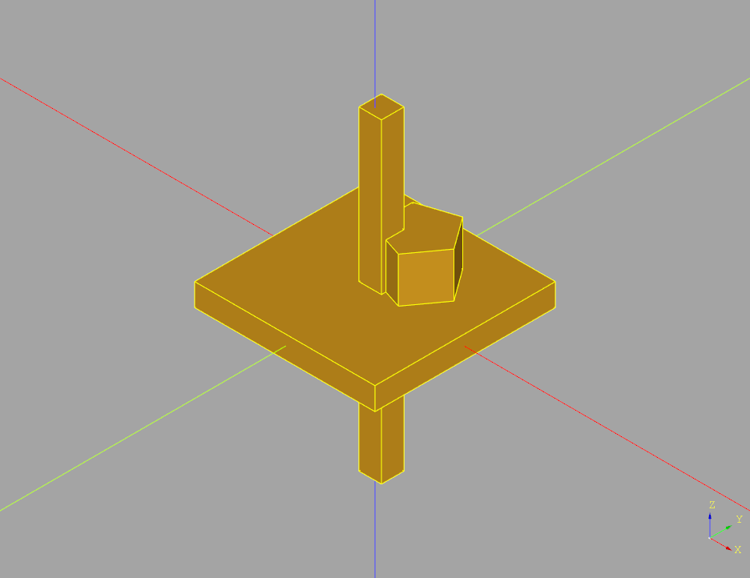
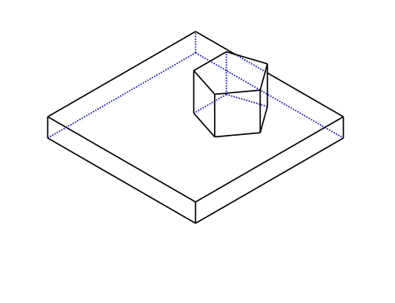
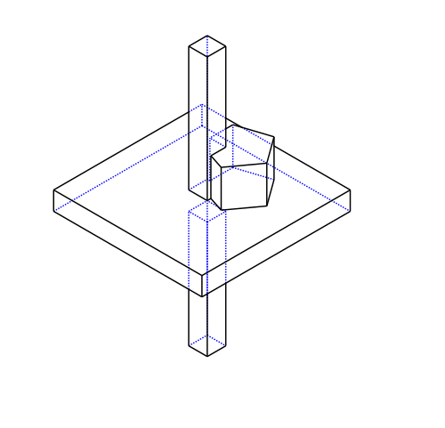

<!--
README.md

Copyright (c) 2022 Eric M. Chen

Change History:
2022-07-30/ec:  Initial release.
-->

# CadQuery-Export-SVG

This is a CadQuery library to export object image in SVG format.

Sample code to export SVG image:

```python
import ExportSvg

r = cq.Workplane()
r = r.box(8.0, 8.0, 1.0)
r = r.faces('>Z')
r = r.workplane()
r = r.moveTo(1.0, 1.0)
r = r.polygon(5, 3.0)
r = r.extrude(2.0)

filePath = 'D:\\Temp\\TestExportSVG-1.svg'
ExportSvg.exportSvg(r, filePath)

r = r.box(1.0, 1.0, 14.0)
filePath = 'D:\\Temp\\TestExportSVG-2.svg'
ExportSvg.exportSvg(r, filePath)

show_object(r)
```

This is the screenshot from <cite>cq-editor</cite>:



The first output file <cite>TestExportSVG-1.svg</cite> from the code:



The second output file <cite>TestExportSVG-2.svg</cite> from the code:



## Resources

### References

* From CadQuery offical document site, see <a target='_blank'
href='https://cadquery.readthedocs.io/en/latest/importexport.html#exporting-svg'>Exporting
SVG</a>.
